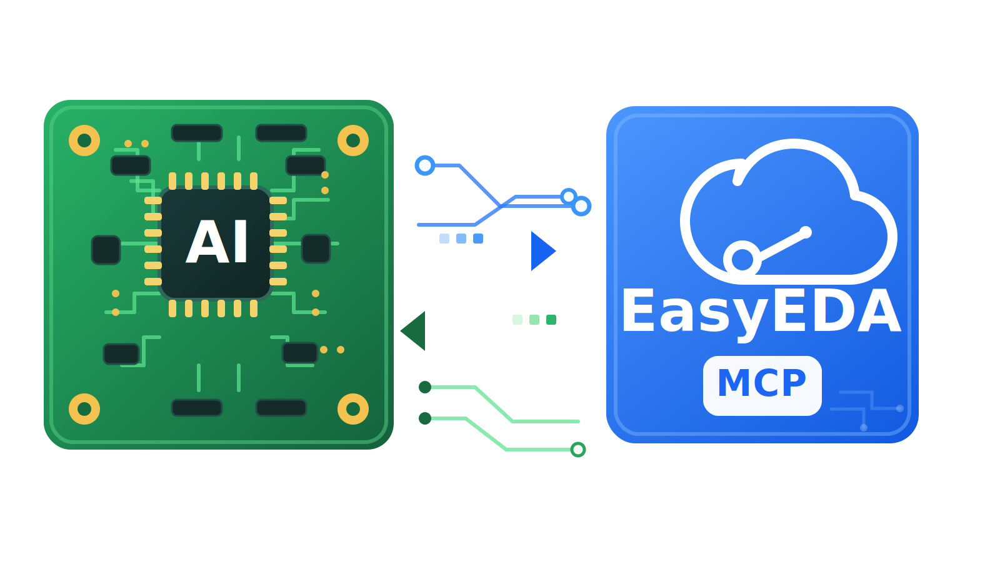
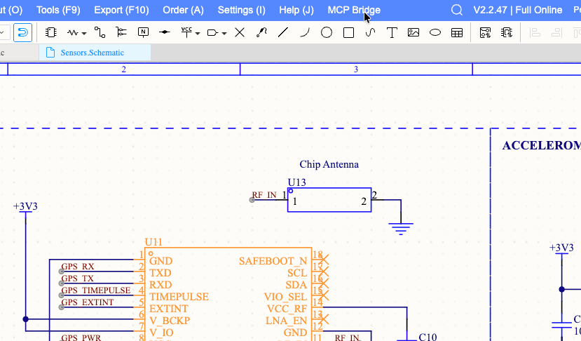

<p align="center">
  
</p>

<h1 align="center">EasyEDA Pro MCP</h1>

<p align="center">
  Connect Claude, Codex, VS Code, and other MCP clients to the live EasyEDA Pro project you already have open.
</p>

<p align="center">
  <a href="https://github.com/VLab-Software/easyeda_mcp/actions/workflows/ci.yml"></a>
  <a href="https://github.com/VLab-Software/easyeda_mcp/releases"></a>
  <a href="./LICENSE"></a>
  
  
</p>

<p align="center">
  <a href="http://vlabsoft.org/easyeda_mcp/quick-start">Quick Start</a>
  ·
  <a href="http://vlabsoft.org/easyeda_mcp/ai-client-setup">AI Client Setup</a>
  ·
  <a href="http://vlabsoft.org/easyeda_mcp/tools">Tools</a>
  ·
  <a href="http://vlabsoft.org/easyeda_mcp/troubleshooting">Troubleshooting</a>
  ·
  <a href="https://github.com/VLab-Software/easyeda_mcp/releases">Releases</a>
</p>

<p align="center">
  
</p>

## Why This Exists

Most AI workflows for PCB design still depend on screenshots, copied text, or manual exports.

EasyEDA Pro MCP gives MCP clients direct structured access to the EasyEDA Pro session already open on your machine, so the AI can inspect real schematic and PCB context instead of guessing.

## What It Is

EasyEDA Pro MCP connects your running EasyEDA Pro session to MCP clients such as Claude, Claude Code, Codex, and VS Code.

It runs locally:

```text
MCP client -> Node.js MCP server -> local WebSocket bridge -> EasyEDA Pro extension
```

Once connected, your AI client can inspect the schematic or PCB you already have open instead of guessing from screenshots or copied text.

## What You Can Do Today

- Inspect the active EasyEDA Pro project from an MCP client
- Read schematic structure including components, pins, nets, wires, and labels
- Trace components and connected nets for faster review
- Validate specific connections with targeted assertions
- Navigate the editor and use export helpers
- Keep the workflow local-first on Windows, macOS, and Linux
- Gate mutating actions behind explicit confirmation

## Who It Is For

- PCB and schematic designers using EasyEDA Pro
- Engineers exploring AI-assisted design review
- Developers building MCP-powered hardware workflows
- Teams who want local-first AI tooling around an existing editor session

## Why Teams Try It

- Better than screenshot-driven AI workflows
- Faster schematic review and net tracing
- Works with the MCP clients people already use
- Local bridge keeps the session on your machine
- Safer write path with confirmation-gated actions

## Quick Start

If this is your first time, use the beginner-friendly guide:

[Start with the cross-platform Quick Start](http://vlabsoft.org/easyeda_mcp/quick-start)

The shortest path to a healthy setup:

```bash
npm install
npm run setup:local
```

Then:

1. configure your MCP client to run `node /absolute/path/to/easyeda_mcp/dist/index.js`
2. open EasyEDA Pro
3. load the packaged extension from `build/dist`
4. enable external interaction permission
5. open a schematic or PCB
6. ask your MCP client to run `easyeda_doctor`

Healthy output should show the extension connected, protocol compatible, and an active document available.

## First 5-Minute Demo

After setup, try these prompts in your MCP client:

```text
Run easyeda_doctor and summarize whether the EasyEDA Pro bridge is healthy.
```

```text
Run easyeda_get_context and tell me which document is open in EasyEDA Pro.
```

```text
Run easyeda_schematic_snapshot and summarize components, nets, warnings, and confidence.
```

## Release Download

For the first public beta, download the EasyEDA Pro extension from GitHub Releases:

[Download the latest beta release](https://github.com/VLab-Software/easyeda_mcp/releases)

Release assets include:

- `easyeda-mcp-bridge_v0.1.0.eext`: versioned EasyEDA Pro extension package
- `easyeda_mcp_bridge.eext`: stable filename for the same extension package
- `SHA256SUMS.txt`: checksums for verification

## Key Capabilities

- Live context from the active EasyEDA Pro project
- Schematic inspection for components, pins, nets, wires, and labels
- Net and component tracing for faster design review
- Connection assertions for targeted checks
- Editor navigation and export helpers
- Local-first runtime built on Node.js
- Works on Windows, macOS, and Linux
- Mutating actions require explicit confirmation

## Example Prompts

Check the bridge:

```text
Run easyeda_doctor and summarize whether the EasyEDA Pro bridge is healthy.
```

Confirm the open document:

```text
Run easyeda_get_context and tell me which document is open in EasyEDA Pro.
```

Inspect a schematic:

```text
Run easyeda_schematic_snapshot and summarize components, nets, warnings, and confidence.
```

Trace a component:

```text
Run easyeda_trace_component for USB1 and summarize its connected nets.
```

## Supported Clients

EasyEDA Pro MCP is designed for MCP-compatible clients such as:

- Claude Desktop
- Claude Code
- Codex
- VS Code
- other compatible MCP clients

## Documentation

Start here:

- [Quick Start](http://vlabsoft.org/easyeda_mcp/quick-start)
- [Getting Started](http://vlabsoft.org/easyeda_mcp/getting-started)
- [AI Client Setup](http://vlabsoft.org/easyeda_mcp/ai-client-setup)
- [EasyEDA Pro Extension Setup](http://vlabsoft.org/easyeda_mcp/easyeda-extension)
- [Troubleshooting](http://vlabsoft.org/easyeda_mcp/troubleshooting)

Reference:

- [Tools Reference](http://vlabsoft.org/easyeda_mcp/tools)
- [MCP Client Setup](http://vlabsoft.org/easyeda_mcp/mcp-client-setup)
- [Safety Model](http://vlabsoft.org/easyeda_mcp/safety)
- [Architecture](http://vlabsoft.org/easyeda_mcp/architecture)

## Build and Test

```bash
npm run setup:local
npm test
npm run typecheck
npm run docs:build
```

`npm run setup:local` builds the MCP server, builds the EasyEDA Pro extension bundle, and packages the `.eext` artifact.

## Scope

This beta is live-session based. EasyEDA Pro must be open and the extension must be connected.

Not included yet:

- offline `.epro` parsing
- commercial/order operations
- unrestricted editor automation

## Security

The bridge listens on `127.0.0.1` by default. Do not expose the bridge port to untrusted networks.

See [SECURITY.md](./SECURITY.md) for reporting and runtime boundaries.

## License

MIT. See [LICENSE](./LICENSE).
