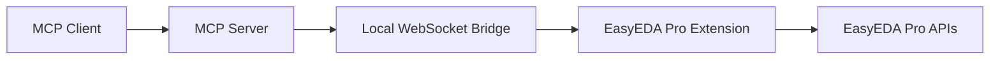

# Architecture

You do not need this page for setup. Use it when you want to understand how the bridge works.

## One-Line Version

The MCP client talks to a local Node.js server. The server talks to an EasyEDA Pro extension over WebSocket. The extension reads the open EasyEDA Pro project through `eda.*` APIs.



## Main Parts

### MCP Server

Entrypoint:

```text
src/index.ts
```

Responsibilities:

- expose MCP tools over `stdio`
- validate tool inputs
- start the local WebSocket bridge
- return structured tool results

### WebSocket Bridge

File:

```text
src/bridge/EasyEdaBridge.ts
```

Default endpoint:

```text
ws://127.0.0.1:8765
```

Responsibilities:

- wait for the EasyEDA Pro extension
- track connection status
- send method calls to the extension
- enforce timeouts
- report compatibility problems

### Tool Layer

File:

```text
src/mcp/registerTools.ts
```

Responsibilities:

- define MCP tool names
- define schemas
- route read-only calls
- gate mutating calls behind confirmation

### EasyEDA Pro Extension

Main file:

```text
extension/src/index.ts
```

Responsibilities:

- connect to the local WebSocket bridge
- receive bridge calls
- call EasyEDA Pro `eda.*` APIs
- return editor data to the MCP server

### Schematic Analysis

File:

```text
src/schematic/analysis.ts
```

Responsibilities:

- normalize components, pins, wires, labels, and nets
- trace nets and components
- find unconnected pins
- validate schematic areas
- verify connection assertions

## Request Flow

When an AI client calls a tool:

1. MCP client calls the local server
2. server validates the tool input
3. server sends a bridge method over WebSocket
4. EasyEDA Pro extension receives the method
5. extension calls EasyEDA Pro APIs
6. result returns to the server
7. server returns the result to the MCP client

## Why It Works This Way

This architecture keeps the system local and live:

- no project export is required for normal inspection
- the AI sees the project that is actually open
- EasyEDA-specific API calls stay inside the extension
- MCP clients get a stable tool interface

## Current Limits

- EasyEDA Pro must be running
- the extension must stay connected
- MCP clients may need a restart after new tools are added
- offline `.epro` parsing is not part of this version
