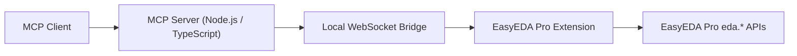

# Architecture

This document explains how the EasyEDA Pro MCP Bridge is structured and how requests flow through the system.

## High-Level Design

The integration is built around a live connection to EasyEDA Pro.

## Main Components

### MCP server

The MCP server starts on `stdio` and exposes the project tools to compatible MCP clients.

Key responsibilities:

- register tool definitions
- validate tool inputs
- forward tool calls to the bridge
- return structured results and failures

Primary entrypoint:

- `src/index.ts`

## WebSocket bridge

The bridge is the live transport layer between the MCP server and the EasyEDA Pro extension.

Key responsibilities:

- open a local WebSocket server
- track extension connection state
- dispatch request/response messages
- enforce per-call timeouts

Important file:

- `src/bridge/EasyEdaBridge.ts`

Default endpoint:

- `ws://127.0.0.1:8765`

## Tool registration layer

Tool definitions are registered in the MCP server and mapped to bridge methods.

Key responsibilities:

- define tool names, descriptions, and schemas
- distinguish read-only operations from confirmed actions
- convert bridge results into MCP tool results

Important file:

- `src/mcp/registerTools.ts`

## EasyEDA Pro extension

The extension runs inside EasyEDA Pro and acts as the runtime adapter between the bridge protocol and the EasyEDA Pro API surface.

Key responsibilities:

- connect to the local bridge with `SYS_WebSocket`
- receive bridge method calls
- call EasyEDA Pro `eda.*` APIs
- return structured results back to the server

Important file:

- `extension/src/index.ts`

## Schematic analysis layer

The project includes a schematic normalization and reasoning layer for generic read-only analysis.

Key responsibilities:

- normalize components, pins, wires, labels, and nets
- infer connectivity when raw API data is partial
- trace components and nets
- detect unconnected pins
- validate focused schematic areas
- verify connection assertions

Important file:

- `src/schematic/analysis.ts`

## Request Flow

When a tool is called:

1. The MCP client invokes a tool on the local MCP server
2. The server validates the input schema
3. The tool handler calls the bridge with a method name and params
4. The extension receives the message over WebSocket
5. The extension runs the corresponding `eda.*` operation or schematic analysis step
6. The result is sent back to the MCP server
7. The MCP server returns the result to the MCP client

## Why This Architecture

This design keeps the system practical for live engineering workflows:

- it works against the currently open EasyEDA Pro session
- it avoids reverse-engineering offline project archives in this version
- it centralizes reasoning in the MCP layer while keeping editor operations in the extension

## Current Limitations

- The system depends on a running EasyEDA Pro session
- The extension must stay connected
- Tool availability in an MCP client may require a client restart after new tools are added
- Offline `.epro` parsing is intentionally out of scope for now
